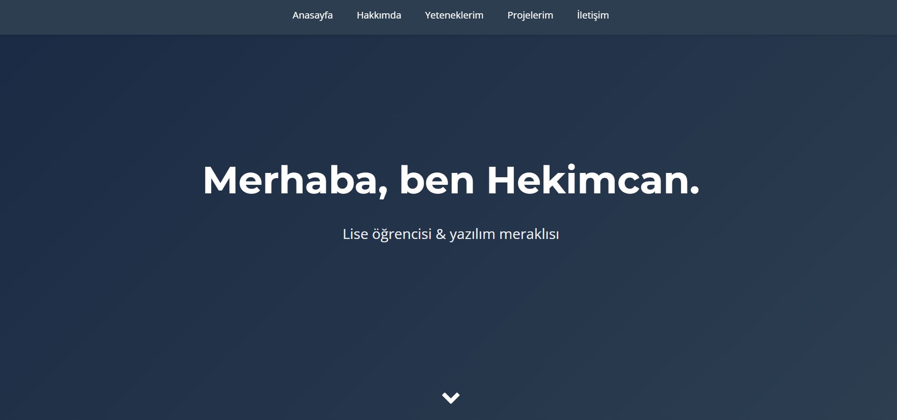

# Personal Site (2018)

> **Not:** Bu proje 2018'de, lise yıllarımda HTML ve CSS öğrenirken
> yazıldı. 2026'da github portfolyomu toparlarken GitHub'a yükledim. Kod kalitesi
> o dönemki bilgi seviyemi yansıtıyor — bilinçli olarak modernize etmedim,
> çünkü öğrenme yolculuğumun bir parçası.

İlk  web sayfam. Saf HTML ve CSS ile, tek sayfa, kişisel portfolyo  sitesi.

## Ne öğrendim?

- HTML5 semantic etiketleri (header, nav, section, footer)
- CSS flexbox temelleri
- Responsive tasarım (basit seviyede, tek breakpoint)
- Google Fonts ve Font Awesome entegrasyonu
- Hover ve transition animasyonları
- Git ile versiyon kontrolü (sonradan)

## Teknolojiler

HTML5 · CSS3 · Vanilla JavaScript

## Çalıştırmak için

`index.html` dosyasını tarayıcıda aç. Build gerekmiyor.

## Ekran görüntüsü

## Lisans

MIT
